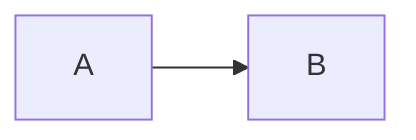

# Requirements

To build and run the documentation locally, you need:

- Python 3.8 or higher
- pip (Python package manager)

# Installation

Install MkDocs and required plugins:

```bash
pip install mkdocs mkdocs-material pymdown-extensions mkdocs-minify-plugin
```

# Running Locally

Start the development server:

```bash
mkdocs serve
```

The documentation will be available at `http://127.0.0.1:8000`

Changes to markdown files will auto-reload.

# Building

Build static site:

```bash
mkdocs build
```

Output will be in the `site/` directory.

# Deployment

## GitHub Pages (Automatic)

The documentation is automatically deployed to GitHub Pages when changes are pushed to the main branch via GitHub Actions.

## Manual Deploy

Deploy manually:

```bash
mkdocs gh-deploy
```

This builds and pushes to the `gh-pages` branch.

# Project Structure

```
docs/
├── index.md                  # Homepage
├── getting-started/
│   ├── introduction.md
│   ├── installation.md
│   └── quick-start.md
├── user-guide/
│   ├── tasks.md
│   ├── lists.md
│   ├── tags.md
│   ├── calendar.md
│   ├── classroom.md
│   ├── collaboration.md
│   └── statistics.md
├── api/
│   ├── overview.md
│   ├── authentication.md
│   ├── tasks.md
│   ├── lists.md
│   ├── tags.md
│   └── users.md
├── development/
│   ├── architecture.md
│   ├── frontend.md
│   ├── backend.md
│   ├── database.md
│   └── contributing.md
└── deployment/
    ├── environment.md
    ├── frontend.md
    ├── backend.md
    └── database.md
```

# Writing Documentation

## Markdown Syntax

Standard markdown plus extensions:

### Admonitions

```markdown
!!! note "Title"
Content here

!!! tip
Content here

!!! warning
Content here

!!! danger
Content here
```

### Code Blocks

````markdown
```javascript
const example = "code";
```
````

### Tabs

```markdown
=== "Tab 1"
Content

=== "Tab 2"
Content
```

### Diagrams

````markdown

````

```

## Contributing

See [CONTRIBUTING.md](development/contributing.md) for guidelines.
```
