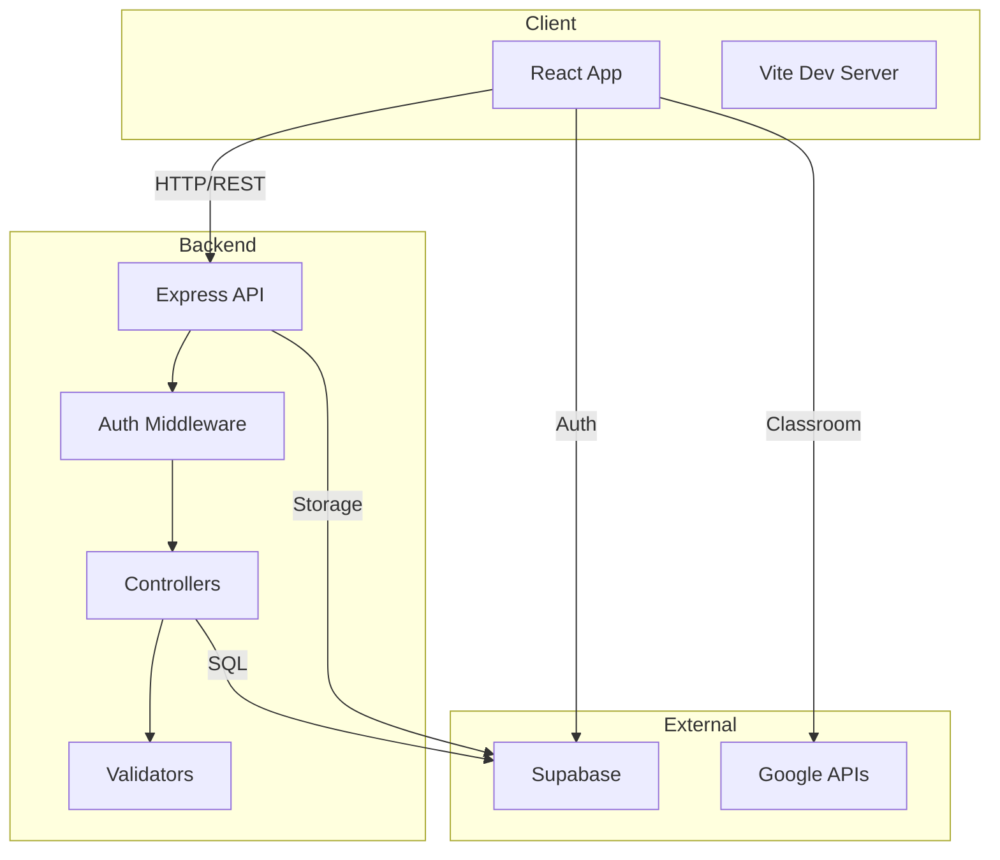
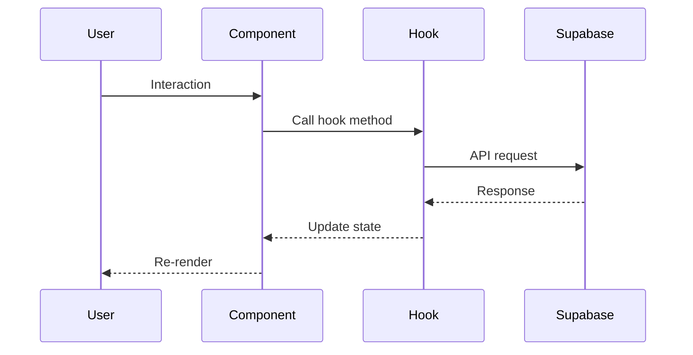
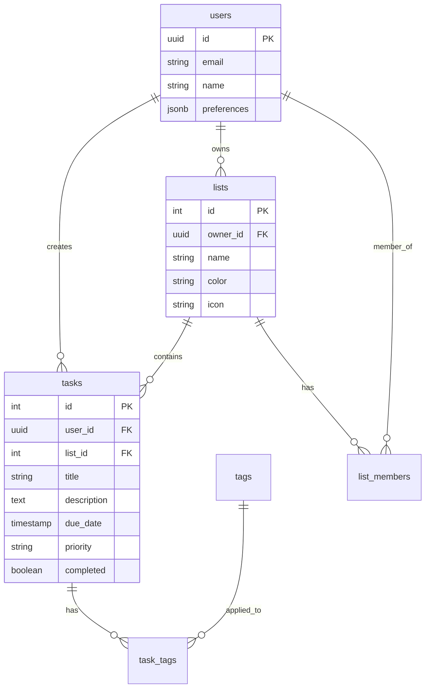
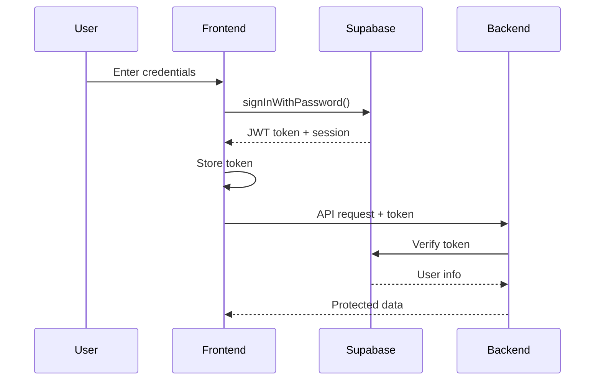

# Architecture

FlickDo follows a modern three-tier architecture with a React frontend, Express backend, and Supabase database.

## System Overview



## Technology Stack

### Frontend

| Technology   | Version | Purpose                 |
| ------------ | ------- | ----------------------- |
| React        | 19.2.0  | UI framework            |
| Vite         | 6.0.5   | Build tool & dev server |
| TailwindCSS  | 4.0.0   | Styling                 |
| Shadcn/ui    | Latest  | Component library       |
| React Router | 7.1.1   | Client-side routing     |
| i18next      | 24.2.1  | Internationalization    |
| Recharts     | 2.15.0  | Data visualization      |

### Backend

| Technology        | Version | Purpose                |
| ----------------- | ------- | ---------------------- |
| Node.js           | 18+     | Runtime                |
| Express           | 4.21.2  | Web framework          |
| Supabase          | 2.47.10 | Database & auth client |
| Express Validator | 7.2.1   | Input validation       |

### Database

| Technology         | Purpose             |
| ------------------ | ------------------- |
| Supabase           | PostgreSQL database |
| Row Level Security | Authorization       |
| Realtime           | Live updates        |

## Project Structure

```
FlickDo/
├── client/               # Frontend application
│   ├── src/
│   │   ├── components/   # React components
│   │   ├── contexts/     # React contexts
│   │   ├── hooks/        # Custom hooks
│   │   ├── lib/          # Utilities
│   │   ├── locales/      # Translations
│   │   ├── services/     # API services
│   │   └── *.jsx         # Pages
│   └── public/           # Static assets
│
├── server/               # Backend API
│   └── src/
│       ├── config/       # Configuration
│       ├── controllers/  # Request handlers
│       ├── middleware/   # Express middleware
│       ├── routes/       # Route definitions
│       └── validators/   # Input validation
│
└── database/             # Database scripts
    └── fulldatabase.sql  # Schema & seed data
```

## Frontend Architecture

### Component Hierarchy

```
App
├── AuthContext
│   ├── Login
│   ├── Home
│   │   ├── Header
│   │   ├── Sidebar
│   │   │   ├── NavItem
│   │   │   └── ProjectItem
│   │   └── TasksList
│   │       ├── TaskCard
│   │       └── TasksFilter
│   ├── ListPage
│   └── Settings
└── CommandContext
    └── GlobalCommand
```

### State Management

**Local State**

- Component-level state with `useState`
- Form state, UI toggles, local filters

**Context API**

- `AuthContext` - User session, profile
- `TasksContext` - Tasks, lists, tags
- `CommandContext` - Command palette state

**Server State**

- Managed with custom hooks
- Real-time sync via Supabase
- Optimistic updates

### Data Flow



### Routing

Client-side routing with React Router:

```javascript
<Routes>
  <Route path="/" element={<Home />} />
  <Route path="/login" element={<Login />} />
  <Route path="/list/:id" element={<ListPage />} />
  <Route path="/calendar" element={<Calendar />} />
  <Route path="/settings" element={<Settings />} />
</Routes>
```

## Backend Architecture

### Layered Structure

```
Request
  ↓
Middleware (auth, validation)
  ↓
Router
  ↓
Controller
  ↓
Supabase Client
  ↓
Database
```

### Request Flow

1. **Middleware Layer**

   - Authentication (JWT validation)
   - Input validation
   - Error handling

2. **Routing Layer**

   - Map HTTP methods to controllers
   - Organize by resource

3. **Controller Layer**
   - Business logic
   - Database queries
   - Response formatting

### Example Flow

```javascript
// Route
router.post('/tasks',
  authMiddleware,           // 1. Authenticate
  validateTask,             // 2. Validate input
  taskController.create     // 3. Execute
)

// Controller
async create(req, res, next) {
  try {
    const { data, error } = await supabase
      .from('tasks')
      .insert(req.body)

    if (error) throw error
    res.status(201).json({ success: true, data })
  } catch (error) {
    next(error)  // 4. Error handling
  }
}
```

## Database Architecture

### Schema Design



### Row Level Security

Supabase RLS policies enforce authorization:

```sql
-- Users can only see their own tasks
CREATE POLICY "Users can view own tasks"
  ON tasks FOR SELECT
  USING (auth.uid() = user_id);

-- Members can see shared list tasks
CREATE POLICY "Members can view shared tasks"
  ON tasks FOR SELECT
  USING (
    EXISTS (
      SELECT 1 FROM list_members
      WHERE list_id = tasks.list_id
      AND user_id = auth.uid()
    )
  );
```

## Authentication Flow



## Real-time Updates

Supabase Realtime for live sync:

```javascript
// Subscribe to task changes
supabase
  .channel("tasks")
  .on(
    "postgres_changes",
    { event: "*", schema: "public", table: "tasks" },
    (payload) => {
      // Update local state
      updateTasks(payload.new);
    }
  )
  .subscribe();
```

## Build & Deployment

### Development

```bash
# Frontend
cd client && npm run dev    # Port 5173

# Backend
cd server && npm start      # Port 3000
```

### Production Build

```bash
# Frontend
cd client
npm run build              # Creates dist/

# Backend - no build needed
cd server
npm start
```

### Environment Variables

**Frontend (.env)**

```env
VITE_SUPABASE_URL=
VITE_SUPABASE_ANON_KEY=
VITE_API_URL=
VITE_GOOGLE_CLIENT_ID=
```

**Backend (.env)**

```env
SUPABASE_URL=
SUPABASE_ANON_KEY=
SUPABASE_SERVICE_ROLE_KEY=
PORT=3000
NODE_ENV=production
```

## Performance Optimizations

### Frontend

- **Code splitting** - Route-based lazy loading
- **Memoization** - React.memo, useMemo, useCallback
- **Virtual scrolling** - Large task lists
- **Image optimization** - WebP, lazy loading
- **Bundle optimization** - Tree shaking, minification

### Backend

- **Connection pooling** - Supabase client reuse
- **Query optimization** - Select only needed fields
- **Caching** - Redis for frequent queries (planned)
- **Rate limiting** - Prevent abuse

### Database

- **Indexes** - On foreign keys, search fields
- **Materialized views** - For complex analytics
- **Partitioning** - Archive old tasks

## Security

### Frontend

- XSS prevention - React's built-in escaping
- CSRF tokens - For state-changing operations
- Content Security Policy
- Secure cookie handling

### Backend

- Input validation - Express Validator
- SQL injection prevention - Parameterized queries
- Rate limiting
- Helmet.js - Security headers

### Database

- Row Level Security - Per-user data access
- Encrypted connections - SSL/TLS
- Password hashing - Supabase Auth
- Backup & recovery

## Monitoring & Logging

### Error Tracking

```javascript
// Frontend
window.addEventListener("error", (event) => {
  logError(event.error);
});

// Backend
app.use((error, req, res, next) => {
  logger.error(error);
  res.status(500).json({ error: "Internal error" });
});
```

### Analytics

- User events (task created, completed, etc.)
- Performance metrics (API response times)
- Error rates
- User engagement

## Testing Strategy

```
Unit Tests
  ├── Components (Jest + React Testing Library)
  ├── Hooks (Jest)
  ├── Utilities (Jest)
  └── Controllers (Jest)

Integration Tests
  ├── API endpoints (Supertest)
  └── User flows (Playwright)

E2E Tests
  └── Critical paths (Playwright)
```

## Next Steps

- [Frontend Guide](frontend.md)
- [Backend Guide](backend.md)
- [Database Guide](database.md)
- [Contributing Guide](contributing.md)
