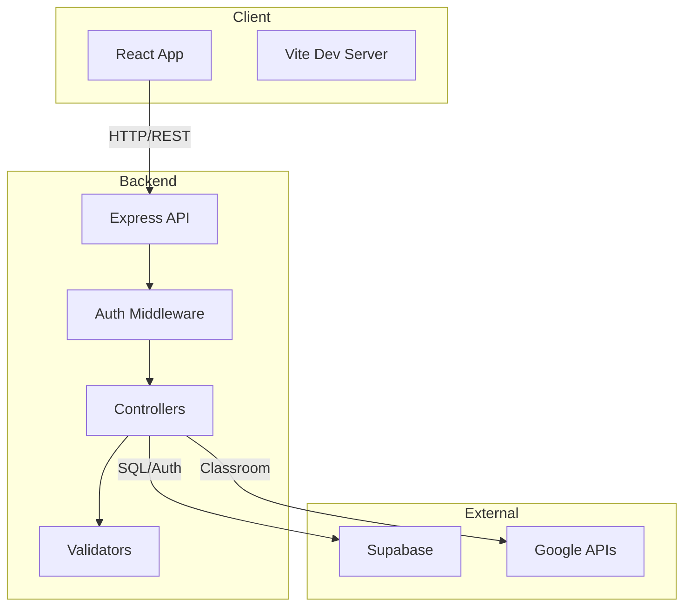
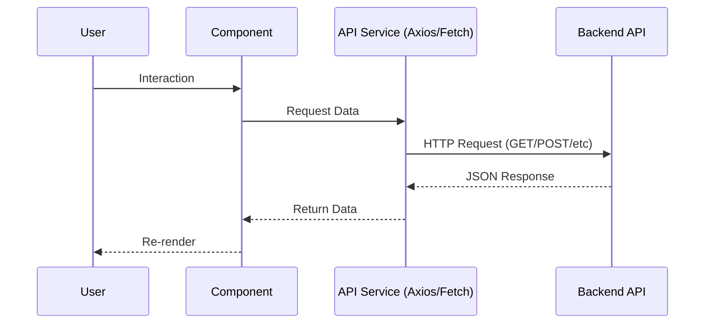
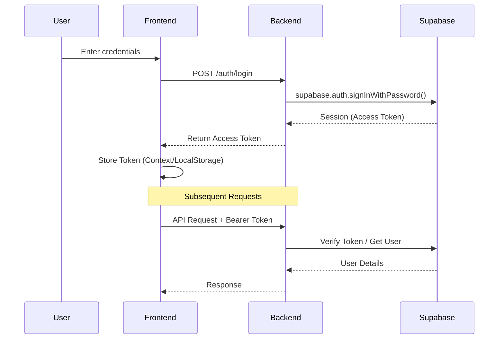
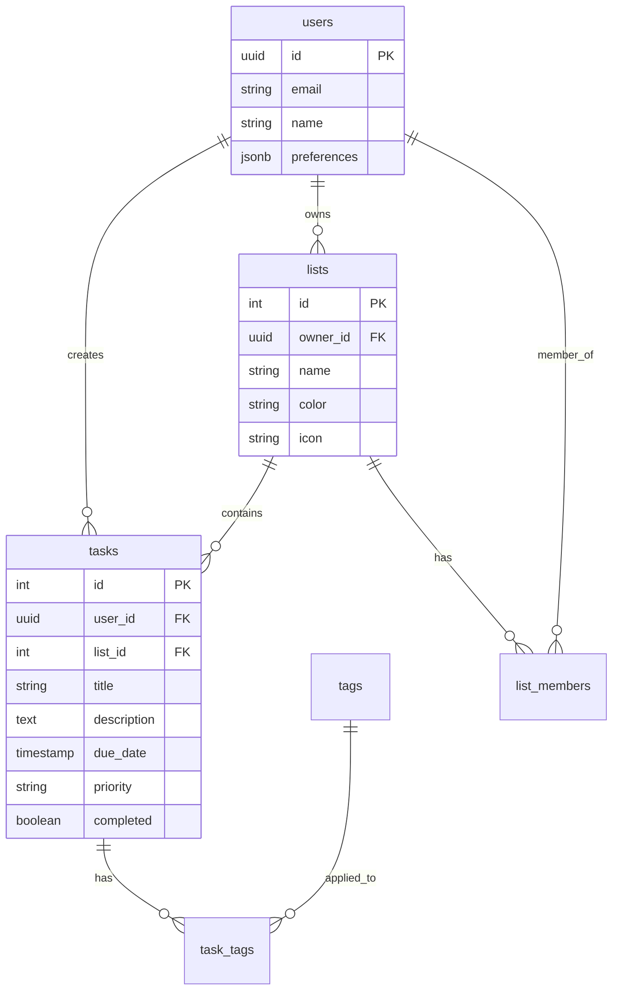

# Architecture

FlickDo follows a strict three-tier architecture where the frontend communicates **only** with the Express backend. The backend acts as the sole interface to the Supabase database and authentication services.

**Strict Rule: The Client (Frontend) NEVER connects directly to Supabase.**

## System Overview



## Technology Stack

### Frontend

| Technology   | Version | Purpose                 |
| ------------ | ------- | ----------------------- |
| React        | 19.2.0  | UI framework            |
| Vite         | 6.0.5   | Build tool & dev server |
| TailwindCSS  | 4.0.0   | Styling                 |
| Shadcn/ui    | Latest  | Component library       |
| React Router | 7.1.1   | Client-side routing     |
| i18next      | 24.2.1  | Internationalization    |
| Recharts     | 2.15.0  | Data visualization      |

### Backend

| Technology        | Version | Purpose                |
| ----------------- | ------- | ---------------------- |
| Node.js           | 18+     | Runtime                |
| Express           | 4.21.2  | Web framework          |
| Supabase          | 2.47.10 | Database & auth client |
| Express Validator | 7.2.1   | Input validation       |

### Database

| Technology         | Purpose             |
| ------------------ | ------------------- |
| Supabase           | PostgreSQL database |
| Row Level Security | Authorization       |

## Project Structure

```
FlickDo/
├── client/               # Frontend application
│   ├── src/
│   │   ├── components/   # React components
│   │   ├── contexts/     # React contexts
│   │   ├── hooks/        # Custom hooks
│   │   ├── lib/          # Utilities
│   │   ├── locales/      # Translations
│   │   ├── services/     # API services
│   │   └── *.jsx         # Pages
│   └── public/           # Static assets
│
├── server/               # Backend API
│   └── src/
│       ├── config/       # Configuration
│       ├── controllers/  # Request handlers
│       ├── middleware/   # Express middleware
│       ├── routes/       # Route definitions
│       └── validators/   # Input validation
│
└── database/             # Database scripts
    └── fulldatabase.sql  # Schema & seed data
```

## Frontend Architecture

### Component Hierarchy

```
App
├── AuthContext
│   ├── Login
│   ├── Home
│   │   ├── Header
│   │   ├── Sidebar
│   │   │   ├── NavItem
│   │   │   └── ProjectItem
│   │   └── TasksList
│   │       ├── TaskCard
│   │       └── TasksFilter
│   ├── ListPage
│   └── Settings
└── CommandContext
    └── GlobalCommand
```

### Data Flow



## Backend Architecture

### Layered Structure

```
Request (from Frontend)
  ↓
Middleware (auth, validation)
  ↓
Router
  ↓
Controller
  ↓
Supabase Client (Server-side only)
  ↓
Database
```

### Request Flow

1. **Middleware Layer**
   - Authentication (JWT validation verified against Supabase by Backend)
   - Input validation
   - Error handling

2. **Routing Layer**
   - Map HTTP methods to controllers
   - Organize by resource

3. **Controller Layer**
   - Business logic
   - Database queries via Supabase Admin/Client
   - Response formatting

### Example Flow

```javascript
// Route
router.post('/tasks',
  authMiddleware,           // 1. Authenticate
  validateTask,             // 2. Validate input
  taskController.create     // 3. Execute
)

// Controller
async create(req, res, next) {
  try {
    // Backend talks to Supabase
    const { data, error } = await supabase
      .from('tasks')
      .insert(req.body)

    if (error) throw error
    res.status(201).json({ success: true, data })
  } catch (error) {
    next(error)
  }
}
```

## Authentication Flow

**Crucial:** The Frontend does NOT call `supabase.auth.signInWithPassword`. It calls the Backend API.



## Security

### Frontend
- XSS prevention
- Secure token storage

### Backend
- The only point of contact with Supabase.
- Manages strict validation before sending data to DB.
- Uses Service Role Key (securely) or Auth Context to interact with Supabase.

## Database Architecture

### Schema Design


