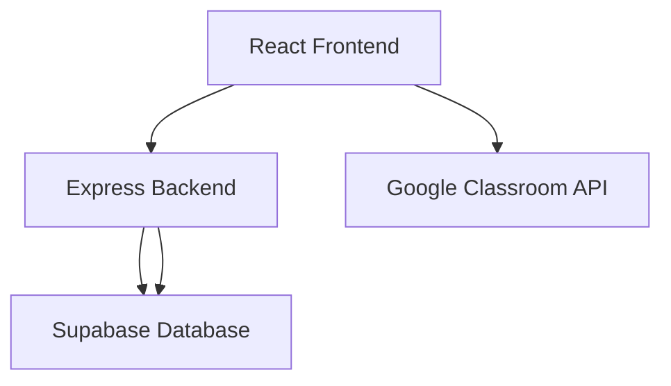

# Introduction

Welcome to FlickDo! This guide will help you understand what FlickDo is, what it can do, and who it's for.

## What is FlickDo?

FlickDo is a modern, feature-rich task management application built for students and professionals who need to organize their work efficiently. It combines traditional task management with modern features like Google Classroom integration, collaborative lists, and productivity analytics.

## Why FlickDo?

### For Students

- **Google Classroom Integration**: Automatically sync assignments and deadlines
- **Calendar View**: Never miss a due date with visual planning
- **Tags & Organization**: Keep coursework organized by subject, priority, or type
- **Collaboration**: Work on group projects with shared task lists

### For Professionals

- **Project Lists**: Organize tasks by project, client, or department
- **Team Collaboration**: Assign tasks and share lists with team members
- **Productivity Stats**: Track your progress and identify patterns
- **Quick Navigation**: Global search (Ctrl+K) for instant access to anything

### For Everyone

- **Beautiful Interface**: Clean, modern design with dark/light mode
- **Responsive Design**: Works seamlessly on desktop, tablet, and mobile
- **Multilingual**: Available in English and Spanish
- **Free & Open Source**: MIT licensed, self-hostable

## Key Concepts

### Tasks

The basic unit of work in FlickDo. Each task can have:

- Title and description
- Due date and time
- Priority level
- Tags for categorization
- Assignment to specific users
- Attachment to a list

### Lists

Collections of related tasks. Think of them as projects, categories, or folders:

- Custom colors and icons
- Public or private sharing
- Collaborative features
- Member management

### Tags

Flexible labels for cross-cutting organization:

- Custom names and colors
- Filter tasks across all lists
- Multiple tags per task

### Calendar

Visual representation of your tasks over time:

- Monthly and weekly views
- Drag-and-drop scheduling
- Integration with Google Classroom events

## Architecture Overview

FlickDo is built with a modern web stack:

- **Frontend**: React 19 with Vite, TailwindCSS, and Shadcn/ui
- **Backend**: Node.js with Express
- **Database**: Supabase (PostgreSQL)
- **Authentication**: Supabase Auth with Google OAuth
- **Deployment**: Vercel (frontend) + your choice (backend)

## Next Steps

Ready to get started? Here's what to do next:

1. **[Installation Guide](installation.md)** - Set up FlickDo on your machine
2. **[Quick Start](quick-start.md)** - Create your first task in 5 minutes
3. **[User Guide](../user-guide/tasks.md)** - Learn all the features in depth

---

!!! question "Need Help?"
If you run into any issues, check our [GitHub Issues](https://github.com/rub3nnn/FlickDo/issues) or create a new one.
